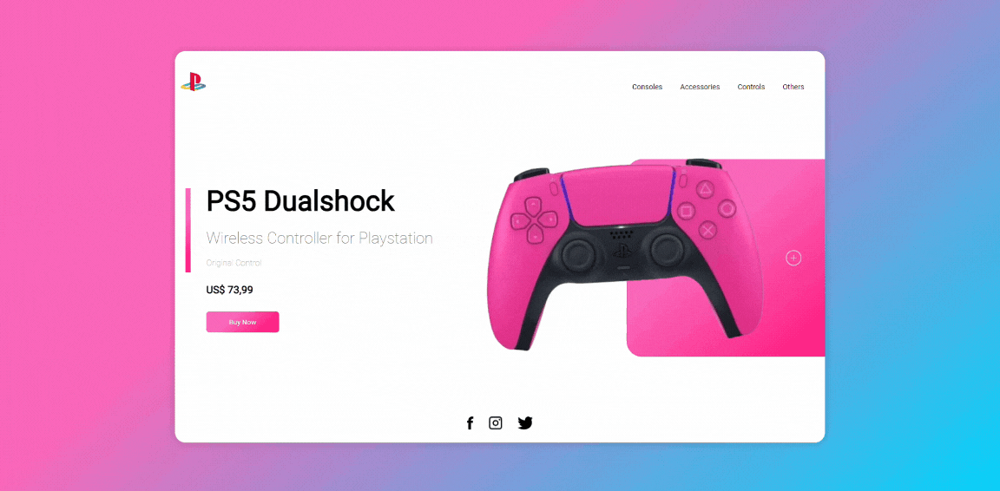

# PlayStation Store

Uma página web responsiva com animações, inspirada na PlayStation Store. Este projeto foi desenvolvido como prática de design responsivo, interações animadas e boas práticas em HTML, CSS e JavaScript.

## ⚡ Visão Geral
Este projeto é uma representação fictícia da loja PlayStation Store, com foco em:
- **Design Responsivo**: Layout adaptável a dispositivos móveis, tablets e desktops.
- **Animações**: Interações visuais suaves, incluindo botões e elementos dinâmicos.
- **Componentes Interativos**: Menu suspenso, transições e botões estilizados.

## 🌐 Tecnologias Utilizadas
- **HTML5**: Estrutura semântica da página.
- **CSS3**: Estilização, responsividade e animações (keyframes, media queries).
- **JavaScript**: Manipulação do DOM para criar interações dinâmicas.

## 🔄 Funcionalidades
- **Menu Interativo**: Mostra e esconde os links de navegação ao clicar no ícone do menu.
- **Design Responsivo**: Layout que se adapta automaticamente ao tamanho da tela.
- **Animações de Controle**: Movimentação e rotação do controle usando keyframes CSS.
- **Botão Dinâmico**: Expande e exibe um ícone ao passar o mouse.
- **Elementos Visuais**: Gradientes modernos e layout estilizado.

## ✨ Demonstração
Confira algumas capturas de tela do projeto:

1. **Versão Desktop**:
<div align="center">
  
</div>

2. **Versão Mobile**:
<div align="center">
  
</div>

## 🔧 Como Executar o Projeto
1. Clone o repositório:
   ```bash
   git clone https://github.com/nubialab/playstation-store.git

2. Navegue até o diretório do projeto:
  ```bash
  cd playstation-store
  ```
3. Abra o arquivo `index.html` em um navegador da web.

## 🎉 Contribuições
Contribuições são bem-vindas! Sinta-se à vontade para abrir issues ou enviar pull requests para melhorias.

## 🔧 Licença
Este projeto é apenas para fins educacionais e não possui licença para uso comercial ou redistribuição.

Desenvolvido com ❤ por [@nubialab](https://github.com/nubialab).
